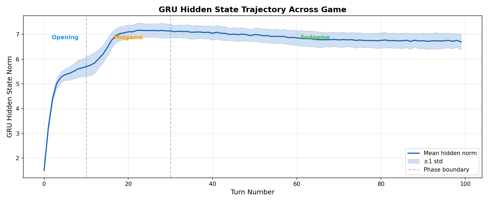
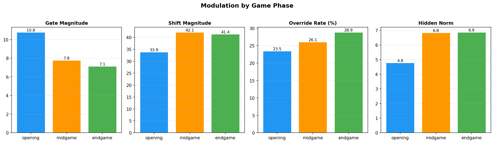
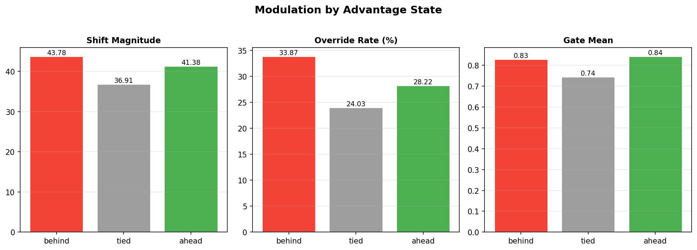
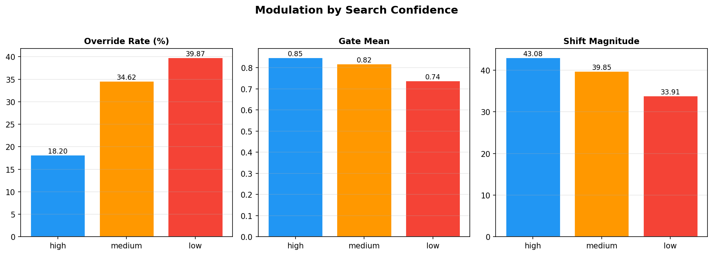
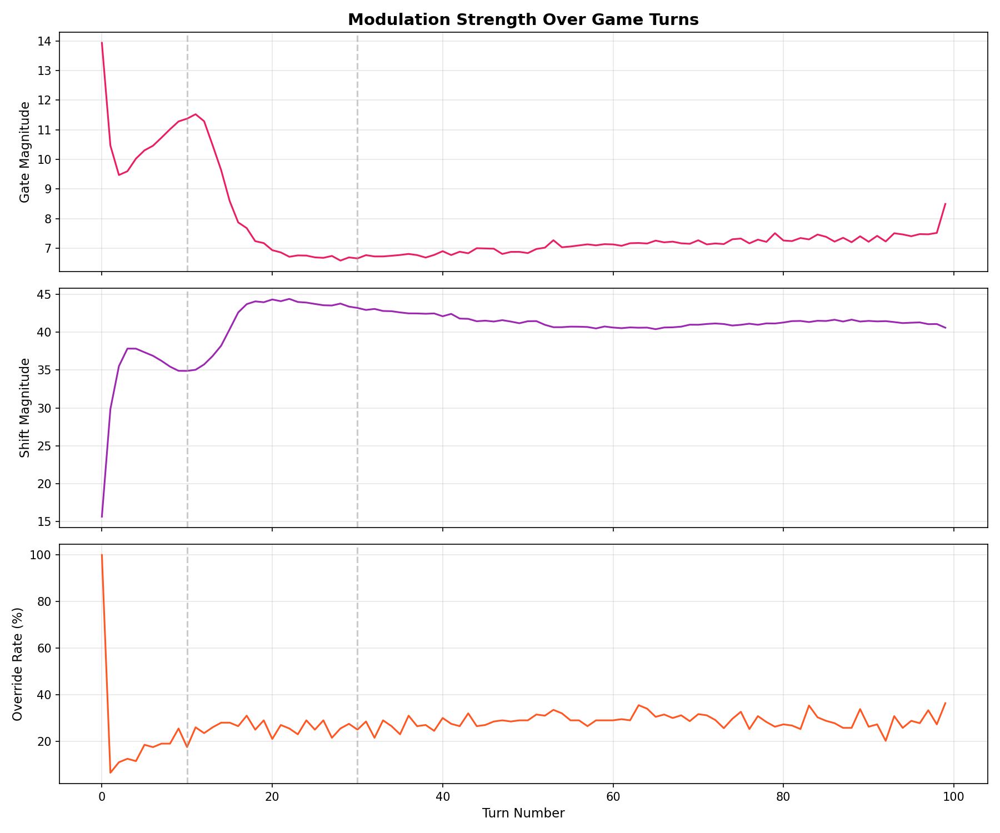
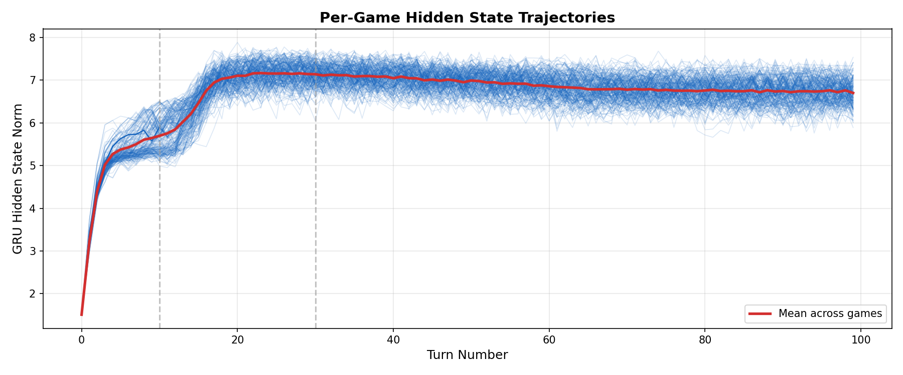
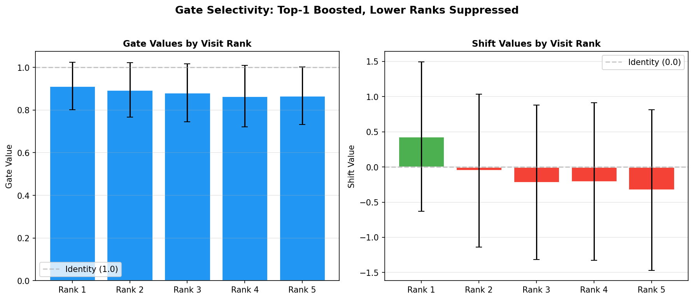

# Search-Conditioned Modulation (SCM) Experiment

A lightweight GRU module that observes MCTS search statistics during gameplay and learns to modulate a frozen policy network's outputs via FiLM conditioning. The GRU learns interpretable, phase-dependent modulation patterns without explicit supervision.

**Paper:** [paper.md](paper.md)

## Key Results

The GRU (367K params) trained on 1,100 trajectories learns three emergent behaviors:

| Finding | Evidence |
|---------|----------|
| **Phase-dependent modulation** | Gate magnitude: 10.8 (opening) -> 7.1 (endgame); Override rate: 23.5% -> 28.9% |
| **Advantage sensitivity** | Override rate: 33.9% when behind vs 24.0% when tied |
| **Confidence calibration** | Override rate: 39.9% (low MCTS confidence) vs 18.2% (high confidence) |

### Plots

| Plot | Description |
|------|-------------|
|  | GRU hidden norm shows charge-stabilize-decay across all 200 games (std < 0.35) |
|  | Gate/shift magnitude varies systematically with game phase |
|  | GRU overrides more when behind, less when ahead |
|  | GRU trusts policy when MCTS is confident, overrides when uncertain |
|  | Modulation strength trajectory across game turns |
|  | Individual game hidden state trajectories |
|  | Top-1 action boosted, lower ranks suppressed |

### Performance (Model A — trained on this model's data)

| Condition | Avg Pins | Max Pins | Wins |
|-----------|----------|----------|------|
| Baseline (no SCM) | **8.0** | 8 | 0/200 |
| SCM 25% blend | 7.2 | **10** | **4/200** |
| SCM 30% blend | 7.1 | **10** | 1/200 |

Fine-grained sweep (200 games per condition): baseline is perfectly deterministic at 8 pins. SCM at 25% blend achieves a 2.0% win rate — the only condition that ever reaches 10 pins.

### Cross-Model Transfer (Model B — GRU never trained on this model)

| Condition | Avg Pins | Max Pins | Wins |
|-----------|----------|----------|------|
| Baseline (no SCM) | 7.0 | 7 | 0/100 |
| **SCM 20% blend** | **7.3** | **10** | **4/100** |

The GRU trained on Model A transfers to Model B, raising it from 0% to **4% win rate**. Model B is locked at exactly 7 pins per game without SCM — zero variance across 100 games. This is the first non-zero win rate against greedy in 3 months of development.

The research value is in both the interpretability analysis AND the transfer result.

## Reproduction

### Prerequisites

- Python 3.12+
- PyTorch (CUDA optional, CPU works)
- NumPy, Matplotlib

### Step 1: Collect SCM Training Data

```bash
python scripts/run_alphazero.py scm \
  --checkpoint experiments/exp_d10_local_continued/best_model.pt \
  --num-blocks 9 --num-filters 96 --heuristic-value \
  --phase collect \
  --collect-games 1100 \
  --sims 200 --max-moves 100 \
  --num-workers 0 \
  --output experiments/scm_v2
```

Data is saved incrementally as `.npz` chunks in `scm_trajectories/` (50 games per chunk). Safe against OOM/crashes.

### Step 2: Train the GRU

```bash
python scripts/run_alphazero.py scm \
  --checkpoint experiments/exp_d10_local_continued/best_model.pt \
  --num-blocks 9 --num-filters 96 --heuristic-value \
  --phase train \
  --train-epochs 100 \
  --identity-reg 0.001 \
  --scm-lr 0.001 \
  --output experiments/scm_v2
```

Expected: KL loss drops from ~0.55 to ~0.38 over 100 epochs.

### Step 3: Evaluate

```bash
python scripts/run_alphazero.py scm \
  --checkpoint experiments/exp_d10_local_continued/best_model.pt \
  --num-blocks 9 --num-filters 96 --heuristic-value \
  --phase eval \
  --eval-games 50 \
  --sims 200 --max-moves 100 \
  --blend-alphas "0.3,0.5,0.7,1.0" \
  --scm-checkpoint experiments/scm_v2/scm_model.pt \
  --output experiments/scm_v2
```

### Step 4: Analyze

```bash
python scripts/analyze_scm_logs.py --log-file experiments/scm_v2/scm_logs/
```

Generates 7 plots in `experiments/scm_v2/plots/` and prints modulation statistics.

### Run All Phases

```bash
python scripts/run_alphazero.py scm \
  --checkpoint experiments/exp_d10_local_continued/best_model.pt \
  --num-blocks 9 --num-filters 96 --heuristic-value \
  --phase all \
  --collect-games 1100 --train-epochs 100 \
  --identity-reg 0.001 --blend-alphas "0.3,0.5,0.7,1.0" \
  --eval-games 50 --sims 200 --max-moves 100 \
  --num-workers 0 \
  --output experiments/scm_v2
```

## Directory Structure

```
experiments/scm_v2/
  paper.md                          # Full research paper
  README.md                         # This file
  scm_model.pt                      # Trained GRU checkpoint (367K params)
  scm_eval_results.json             # Eval metrics (pins, wins per condition)
  scm_trajectories/                 # Training data (.npz chunks)
    chunk_0000.npz ... chunk_0039.npz
  scm_logs/                         # Per-turn modulation logs (JSONL)
    scm_logs_*.jsonl
  plots/                            # Analysis visualizations
    01_hidden_state_trajectory.png
    02_modulation_by_phase.png
    03_modulation_by_advantage.png
    04_modulation_by_confidence.png
    05_modulation_over_turns.png
    06_per_game_trajectories.png
    07_gate_selectivity.png
```

## Source Code

| File | Description |
|------|-------------|
| `src/network/search_conditioned_modulator.py` | GRU model, FiLM conditioning, search feature extraction, logging |
| `src/training/scm_trainer.py` | BPTT training loop on game trajectories |
| `src/training/scm_self_play.py` | Data collection (parallel workers) and evaluation |
| `src/search/mcts.py` | MCTS with search stats extraction (`get_action_probs_with_stats`) |
| `src/network/alphazero_net.py` | Policy network with raw logit access (`predict_raw_logits`) |
| `scripts/run_alphazero.py` | CLI (`scm` subcommand) |
| `scripts/analyze_scm_logs.py` | Post-hoc analysis and plot generation |

## Hyperparameters

| Parameter | Value | Notes |
|-----------|-------|-------|
| GRU hidden dim | 128 | |
| Search feature dim | 14 | top-5 visits, top-5 Q, KL, root_val, depth, turn |
| Max shift | 2.0 | tanh * max_shift |
| Identity reg (lambda) | 0.001 | L2 on (gate-1) and shift |
| Learning rate | 1e-3 | Adam |
| Gradient clip norm | 1.0 | |
| Training epochs | 100 | |
| Training games | 1,100 | ~110K turn-level steps |
| MCTS sims | 200 | Per move |
| Max game length | 100 | Moves |
| Gate init bias | 2.0 | sigmoid(2) ~ 0.88 |
| Weight init std | 0.01 | Near-identity at start |

## Citation

```bibtex
@article{hessnawi2026scm,
  title={Search-Conditioned Modulation: Emergent Meta-Cognition in Game-Playing Agents Through Recurrent Search Observation},
  author={Hessnawi, Yasin},
  year={2026}
}
```
